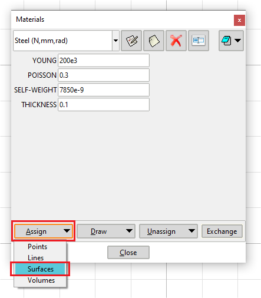
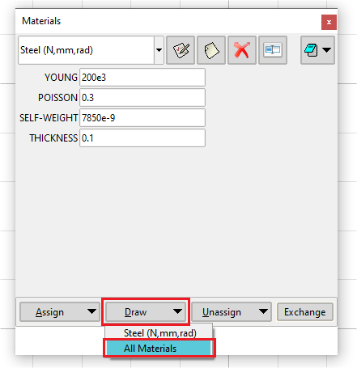

# 1. Mesh generation with GiD and MAT-Fem

---

### 1.1. GiD

GiD is a user-friendly pre and post-processing software developed by the International Center for Numerical Methods in Engineering [(CIMNE)](www.cimne.com) that is easy to use and customize.  The software handle meshes with 1D, 2D and 3D elements and the free version can export meshes with up to 10,000 nodes. More information, manuals and download is available at [GiD Simulation](https://www.gidsimulation.com/gid-for-science/). 

#### Download and Installation

If you're having issues installing GiD, please refer to [the official GID installation page](https://www.gidsimulation.com/gid-for-science/support/installation/).

### 1.2. MAT-Fem

Along with GiD, we use the [MAT-Fem](https://www.gidsimulation.com/downloads/educational-finite-element-codes-matfem/) plugin to assign material properties and export the mesh as a Python-ready file. The export is done with a `MAT-Fem.bas` edited file that can be found [in this folder](https://github.com/tiagoburiol/fb.beamSection/tree/main/mesh_files). MAT-Fem is a GiD plugin developed by researchers at [CIMNE](https://cimne.com/) and made to be a Finite Element utility to generate meshes to be used with MATLAB codes.

#### Download and Installation

To download MAT-Fem visit the [GiD downloads page](https://www.gidsimulation.com/downloads/educational-finite-element-codes-matfem/).

* You can install MAT-Fem by putting the downloaded file on the `problem types` folder on GiD's installation folder (default: *C:\Program Files\GiD\GiD <version>\problemtypes*)

* MAT-Fem, can also be initialized from __*Data > Problem Type > Load*__  tab on GiD. On the ***Read Problem Type*** window navigate to the folder where `MAT-Fem.gid` is downloaded and click **Open**. 

#### 1.3. The .bas File

The .bas file is a template for exporting the mesh in a format suitable for use in the BeamSection class.

* You can also place the `MAT-fem_Python_Multimat_dens.bas` file from this repository in the Tamplates folder on GiD's installation folder (default: *C:\Program Files\GiD\GiD <version>\templates*) if you wish for it to be more easily accessed inside GiD as one of the options at ***Files > Export > Using template .bas (only mesh)***. 

* Other-wise you'll have to go to t ***Files > Export > Using template .bas (only mesh) >  Others...*** and navigate to where the .bas file is located at every time you wish to export a mesh. 

# 2. Steps

---

 After opening GiD, If you have MAT-Fem already installed in the`problem types` folder go to ***Data > Problem Type > MAT-Fem***, or go to __*Data > Problem Type > Load*__  and find where the MAT-Fem.gid file is. A welcome window (**Fig. 1**) wil appear and a new sidebar (**Fig. 2**) will be available. 

|  |  |
| -------------------------------------------- | -------------------------------------------- |
| **Fig. 1** -  MAT-Fem welcome window.        | **Fig. 2** -  MAT-Fem sidebar.               |

### 2.1. Draw Geometry

Use the ***create line***  tool to draw straight lines; the ***create arc***   for circular arcs and ***create nurbs line***  for curves (splines). More options are also available on the ***Geometry*** tab (**Fig. 3**). GiD also has capabilities to import geometry from CAD editors and various formats on the ***File > Import*** tab (**Fig. 4**). 

> <mark>The geometry HAS to be drawn ONLY on the XY plane on GiD. But the mesh will be exported in the YZ plane and trated as so inside the BeamSection class.</mark>

|  |  |
| -------------------------------------- | ------------------------------ |
| **Fig. 3** -  Geometry tab.            | **Fig. 4** -  Import options.  |

### 2.2. Define Surfaces

It is important that you define *surfaces*  in the geometry so GiD undertands that 2D element meshes should be generated. To define a surface click the ***Create NURBS surface***  tool, select only the parts of the geometry that is closed by clicking and holding the left mouse button (**Fig. 5**) (make sure that the geometry is *closed*, otherwise the surface can't be defined) then press the ***Esc*** keyboard key to confirm your selection. *<mark>Remember that in GiD, to confirm a action you use the **Esc** key! </mark>* After that, if a valid surface is created, a smaller copy of the geometry will appear in magenta color inside the original drawing, illustrating that the geometry now represents a surface (**Fig. 6**). 

|  |     |
| -------------------------------------------------------------------------- | ------------------------------------------- |
| **Fig. 5** -  Selecting geometry to define a surface.                      | **Fig. 6** -  Surface created successfully. |

### 2.3 Assign Material

The most convenient way to assign material to geometry is before mesh creation, by assigning the material properties to surfaces. This way, if you wish/need to regenerate the mesh the assigment stays defined. To do that, with the MAT-Fem sidebar, open click the ***Assign Material Properties***  button. The Materials window will appear (**Fig. 7**). You can directly edit the properties currently shown on the window and save you own material definition if you wish. GiD does export measument units, only the values  as they appear in the material window, so <mark>make sure to remember the units of length, stress and mass you used</mark>. 

> Note: the `thickness` property is not used in our program, so it can be left as is. 

After filling the properties, click the ***Assign*** button then the ***Surfaces*** option (**Fig. 7**). Now you can select multiple surfaces to assign the current properties to. After selection (**Fig. 8**) press the ***Esc*** key to confirm. On the materials window you can alse use the ***Draw*** button to show the assignment of specific materials or all materials (**Figs. 9** and **10**) to verify if the assignment step was done correctly.

|              |  |
| ----------------------------------------------------------------- | -------------------------------------------------------------------------------------------- |
| **Fig. 7** -  MAT-Fem materials window.                           | **Fig. 8** -  Surface selected for material assignment.                                      |
|  |         |
| **Fig. 9** -  Draw material option.                               | **Fig. 10** -  Displaying assigned materials.                                                |

### 2.4 Assign Element Type and Interpolation Order

 By default, GiD generates 2D meshes with linear triangular elements, if you want other element type go to ***Mesh > Element Type*** and select either Triangle, or Quadrilateral (**Fig. 11**). 

> **Important:** *To correctly generate quad meshes, make sure the surfaces are bounded by only 4 lines (which may be curved or straight), otherwise GiD wont be able to generate a mesh of quads*. 

After that, you'll be prompted to select the geometry. After selection press the ***Esc*** key to confirm. To change the intepolation order go to **Mesh > Quadratic Type** and select between ***Normal*** (Linear), ***Quadratic*** or ***Quadratic9*** (**Fig. 12**). The last option is for complete quadratic Lagrange elements Tri-6 and Quad-9, the second is for Quad-8 serendipidy elements. The interpolation option is automaticaly applied to the entire mesh by GiD to ensure compatibility.

|  |  |
| ---------------------------------------------------- | ------------------------------------------------------ |
| **Fig. 11** -  Selecting element type.               | **Fig. 12** -  Selecting interpolation order.          |

### 2.5 Assign Mesh Parameters

GiD is able to generate both unstructured (**Fig. 13**) and structured (**Fig. 14**) meshes and you have control over a few parameters so that the resulting mesh is adequate for your application. Under the options for ***structured*** meshes you'll have to select either ***lines*** or ***surfaces***  to assign parameters to. For surfaces you may choose to assign ***number of divisions*** or ***element size*** to any ***sides*** of a surface (**Fig. 14**). The same choices are applicable to the lines option. 

When assigning structured parameters to a surface take notice that the following steps are required: 

1. First you'll be prompted to <mark>*choose the surfaces*</mark>, then  <mark>press the **Esc** key</mark>;

2. After that a dialogue box will appear for you to *<mark>type the value</mark>* of the parameter and <mark>click on **Assign**</mark>;

3. *<mark>Select the sides to apply the paramenter to</mark>* then <mark>press the **Esc** key </mark> to apply the parameters;

4. A new dialogue window will reappear, returning to Step 1.

5. To exit you can close the dialogue window.
   
   

If you wish to generate a unstructured mesh on a given surface, you may just select ***Mesh > Unstructured > Surfaces*** and select which surfaces may be left unstructured.

|  |  |
| ---------------------------------------------------- | ------------------------------------------------------------------------ |
| **Fig. 13** -  Unstructured mesh options.            | **Fig. 14** -  Structured surface mesh options.                          |

### 2.6 Generate Mesh

To generate the mesh you may use the ***Generate Mesh***  button from MAT-Fem, or access the tab ***Mesh > Generate Mesh***, or the keyboard shortcut Ctrl + G. The mesh generation window will appear (**Fig. 15**). The element size option will only apply to geometry that has not been given structured parameters. Type a element size or leave it as-is then click on **Ok**. The ***Progress in meshing*** window will appear and display a graph with the evolution of the meshing process over time. Pay special attention to the context box above the graph, there will be shown the type and number of elements generated. *<mark>Make sure no **line elements** are generated</mark>*. If there are any, get rid of any single lines that are not conected to surfaces and mesh again. If you cannot find them, the **Delete Duplicates**  tool can be helpful. Also, <mark>*make sure only **a sigle type of element** is present*</mark> -- either triangles or quadrilaterals -- because internally the BeamSection class assumes the mesh is composed only of a single element type. Click on **View mesh** to see the result.

|  |  |
| ------------------------------------------------------------ | --------------------------------------------------------- |
| **Fig. 15** - "Generate mesh" window.                        | **Fig. 16** -  "Progress in meshing" window.              |

### 2.7 Export Mesh

After generation the mesh can be exported as various file types on **Files > Export**. To export a mesh compatible with the BeamSection class use the `.bas` file provided in  [this folder](https://github.com/tiagoburiol/fb.beamSection/tree/main/mesh_files) and save it on the `templates` folder on GiD's intallation folder. This way, to export the mesh go to ***File > Export > Using template .bas (only mesh) > MAT-fem_Python_Multimat_dens.bas***. A dialog box will appear; navigate to a desired folder and *<mark>**don't forget to name the file with a ``.py``  extension!**</mark>*.

# 3. Step-by-Step Structured Mesh Example

---

Figs. 17 to 28 show the steps to generate a structured mesh with 4 elements across the horizontal lines and 8 elements across the vertical lines of a trapezoidal geometry.

1. Use the line tool to draw a trapezoidal shape like shown in **Fig. 17**. When clicking the last point on the last edge the **Create point procedure** window will appear (**Fig. 18**); click on **Join** to make sure the geometry will be closed. Press **Esc** to exit the line tool.

2. Click the **Create NURBS surface**  button, select the geometry (**Fig. 19**); press **Esc** to confirm and check the created surface (**Fig. 20**). 

3. Assign material properties on the surface with the **Assign Material Properties** button on the MAT-Fem side bar; Enter the desired values; click on the button **Assign > Surfaces** (**Fig. 21**); select the surface and press **Esc** to confirm. 
   
   > If the sidebar is not present, go to ***Data > Problem type > MAT-Fem***, if you have MAT-Fem in the *Problem types* folder on the GiD installation folder; or ***Data > Problem type > Load...*** and navigate to the where *MAT-Fem.gid* is downloaded. 

4. Select element type on **Mesh > Element Type > Quadrilateral** then select the surface and press **Esc** to confirm.

5. Select element order on **Mesh > Quadratic type > Quadratic9**  (to assign Quad-9 elements)
   
   > You may choose to assign element type **before** or **after** material assignment, not necessarily in the order shown in this tutorial.

6. Go to **Mesh > Structured > Surfaces > Assign number of divisions to surface lines** (**Fig. 22**) and select the trapezoidal surface.

7. Press **Esc** to confirm..

8. Type 4 in the box for the number of divisions and click **Assign** (**Fig. 23**).  

9. Select the upper edge (**Fig. 24**). 
   
   > Notice the bottom edge will also be selected, since in a structured mesh opposite sides must have the same number of elements.

10. Press **Esc** on the keyboard. This will assign 4 divisions on the selected lines. After, the Dialog window will reappear.

11. To assign a new size to the vertical lines, type 8 in the box then click **Assign** (**Fig. 25**).

12. Select either the left of the right edge (**Fig. 26**). 
    
    > Notice the other edge will also be selected.

13. Press **Esc** on the keyboard. This will assign 8 divisions on the selected lines. After, the Dialog window will reappear.

14. Close the dialog box.

15. Click the **Generate mesh**  button then **Ok**. Make sure there are only quadrilateral elements then click **View Mesh** (**Fig. 27**). To see the element and node labeling use the **Set all labels on/off**   button (**Fig. 28**). 
    
    > If there are any line elements you can't see the **Delete duplicate**  tool can be useful.

16. Export the mesh on ***File > Export > Using template .bas (only mesh) > MAT-fem_Python_Multimat_dens.bas*** making sure to give it a name and a .py extension (**Figs. 29** and **30**).
    
    

|                       |                         |
| ------------------------------------------------------------ | --------------------------------------------------------------- |
| **Fig. 17** -  Draw geometry.                                | **Fig. 18** -  Join last and first point.                       |
|            |                          |
| **Fig. 19** -  Selecting lines to make surface.              | **Fig. 20** -  Generated surface.                               |
|             |           |
| **Fig. 21** -  Assigning materials to surface.               | **Fig. 22** -  Assigning structured mesh parameters to surface. |
|         |  |
| **Fig. 23** -  Selecting divisions for the horizontal lines. | **Fig. 24** -  Selecting horizontal lines for division.         |
|   |    |
| **Fig. 25** -  Selecting divisions for the vertical lines.   | **Fig. 26** -  Selecting vertical lines for division..          |
|        |       |
| **Fig. 27** -  Generated mesh.                               | **Fig. 28** -  Mesh labeling.                                   |
|               |               |
| **Fig. 29** - Exporting mesh.                                | **Fig. 30** - Naming the file.                                  |

# Useful Tips for Geometry Editing

---

* GiD is a buggy program. Be sure to save your project often as you edit.

* The free version of GiD allows only a limited number of surfaces to be saved on a file, but you can still export the mesh and later delete a few surfaces to be able to save the project.

* Use Shift + Right Mouse Button to pan the drawing area and the Mouse Wheel to zoom in/out. 

* Use the **View XY plane**  button to reset the view. Depending on the monitor resolution it may not be visible; another way is ***View > Rotate > Plane XY***.

* At any point you can delete geometry by clicking the **Delete**  button an then delecting the type of geometry to delete.

* After generanting the mesh, you may swich between mesh and geometry views using the **Toggle geometry/mesh view**  button.

* You can show node and element labels by clicking the **Set all labels on/off**  button. Also accessible via ***View > Labels > All on***.

* You can subdivide lines with the **Divide line into a number of segments**  tool. Note that the original line will be substituted by the new segments. You can intersect lines with the **Intersect lines**   tool. Similar tools are available for surfaces as well.

* Before mesh creation it can be useful to collapse points and lines that are too close together with the **Delete duplicate entities with a tolerance**  tool. Also accessible via ***Geometry > Edit > Colllapse > Model***
